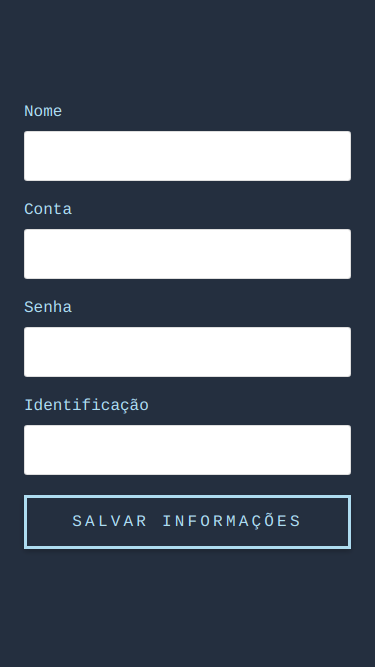

<p>
  <a href="https://circleci.com/gh/cesar-cb/ahgora-web-app">
    
  </a>
  <a href="https://codeclimate.com/github/cesar-cb/ahgora-web-app/maintainability">
    
  </a>

  <a href="https://codeclimate.com/github/cesar-cb/ahgora-web-app/test_coverage">
    
  </a>
</p>

# Ahgora Web App

## How to use it

### **Step 1**:

Fill out your information:

**Nome**

**Conta**

**Senha**

**Identificação** (from localstorage)



### **Step 2**:

Here you can **punch** the button or **reset** your information and get back to user information screen.


## Setup

### Make sure you have Yarn installed
[https://yarnpkg.com/lang/en/docs/install](https://yarnpkg.com/lang/en/docs/install)

### Install dependencies
```
yarn install
```

### Start Server
```
yarn start
```

### Run Tests
```
yarn run test
```
